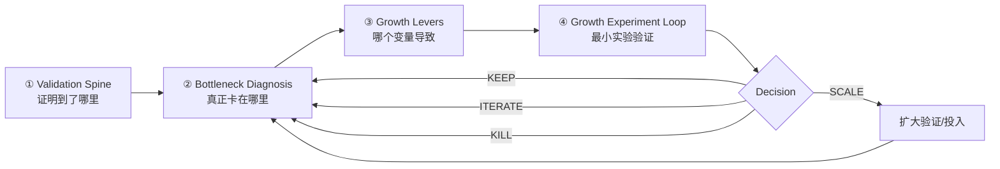

<div align="center">

# 📈 Acquisition Growth Radar（获客增长雷达）

### 商业增长诊断与验证 Skill

**不是渠道清单，也不是“多发内容、多投广告”的建议合集。它专门回答：现在到底证明到了哪一步、为什么还没挣到钱、下一步最值得验证什么。**

[简体中文](./README.md) · [English](./README_EN.md) · [完整 Skill 规则](./SKILL.md)


</div>

---

## 它解决什么问题？

很多项目不是没有动作，而是**不知道真正卡在哪里**：

- 有播放量但没人买，是需求、Message 还是 Offer 的问题？
- 有人点进来但不用，是 Onboarding 还是价值不够？
- 用户觉得“挺好”，为什么还是不付钱？
- 是用户不想要，还是不相信？
- 第一单出现后，什么时候才算可以重复？
- 有成交但亏钱，到底还能不能 Scale？

**Acquisition Growth Radar** 默认不先给 20 条增长建议，而是先问：

> **已经证明了什么？当前最大瓶颈在哪里？哪个变量最可能导致？最小验证实验是什么？**

---

## v0.2：四个核心系统



一句话：

> **先判断已经证明了什么 → 找当前最大瓶颈 → 判断哪个变量最可能导致 → 用最小实验验证 → KEEP / ITERATE / KILL / SCALE。**

---

## ① Validation Spine｜商业验证主干

v0.2 不再把所有东西硬塞进一条漏斗，而是分成三类。

### Value Reality

```text
Problem Evidence
↓
Solution Proof
```

先确认：问题是真的，方案也真的有效。

### Customer Behavior

```text
Attention
↓
Interest
↓
Intent
↓
Transaction
```

这些是用户真实行为证据。

所以：

> **播放量不是需求，点赞不是购买意愿，询问不是成交，一单不是 PMF。**

### Business Viability

```text
Transaction
   ├─ Repeatability
   └─ Economics
          ↓
        Scale
```

Repeatability 与 Economics 可以并行验证；二者都不足时，不应贸然 Scale。

---

## Activation / Aha 不固定位置

Activation 定义为：

> **用户第一次亲自体验到核心价值的时刻。**

它可能发生：

```text
PRE_TRANSACTION
付款前：AI 工具、测评、免费试用、免费诊断
```

也可能：

```text
POST_TRANSACTION
付款后：实物商品、咨询、课程、服务交付
```

甚至两边都有：

```text
BOTH
免费层先有一次 Aha，付费层再出现更强价值体验
```

所以“注册成功”不自动等于 Activation。

---

## Trust 是横向变量

```text
               TRUST
────────────────────────────────→
Attention → Interest → Activation → Intent → Transaction → Retention
```

最重要的问题之一是：

> **用户是不想要，还是不相信？**

Trust 可以来自：Proof、Demo、Reviews、Authority、Transparency、Guarantee、Risk Reversal、Privacy、Security、Refund policy 等。

---

## ② Bottleneck Diagnosis｜先找断点

| 现象 | 优先检查 |
|---|---|
| 几乎没人看到 | Channel / Distribution / Audience |
| 看到了但不停留 | Hook / Creative |
| 停留但不点击 | Message / Value Proposition |
| 点击但不开始体验 | Friction / Onboarding |
| 体验了但没有 Aha | Solution / Value Experience |
| 有 Aha 但不付钱 | Offer / Trust / Price / Unresolved Need |
| 想买但没完成 | Conversion Friction / Payment / Risk |
| 有成交但亏钱 | Economics |
| 一轮有效下一轮失效 | Repeatability |
| 一放预算 CAC 就恶化 | Scale ceiling |

Skill 的目标不是“什么都优化”，而是先找到**当前最大的断点**。

---

## ③ Growth Levers｜可以动的旋钮

证据 = 实际发生了什么。  
Lever = 我们可以改什么。

核心 Levers：

- Audience / Situation
- Message / Creative
- Proof / Trust
- Value Experience / Activation
- Offer / Price
- Conversion Path / Friction
- Channel / Distribution

**Message、Offer、Channel、Trust 都不是 Evidence Ladder 的阶段。**

---

## ④ Growth Experiment Loop｜每天真正执行的东西

默认使用 Lite Loop：

```text
当前瓶颈：
我的假设：
本轮只改：
核心指标：
成功标准：
Kill 条件：
结果：
Learning：
Decision：KEEP / ITERATE / KILL / SCALE
```

核心可以浓缩成：

> **瓶颈 → 假设 → 一改 → 一指标 → 决策**

重要、高成本、需要严格归因的实验，再升级到 Full Acquisition Cell。

> **Lite 用来跑得快，Full 用来跑得准。**

---

## Free Value → Paid Expansion

适用于 SaaS、AI 工具、测评、咨询、内容产品等：

```text
Free Value
= Complete but bounded win

Paid Value
= More Depth
+ More Scope
+ More Speed
+ More Personalization
+ More Continuity
+ More Certainty
```

原则：

> **免费证明价值，付费扩大价值。**

不是故意把免费版做残。

---

## 四种决策

### KILL
证据足以说明当前假设/组合不值得继续。

### ITERATE
方向仍有机会，但至少一个核心 Lever 需要改变。

### KEEP
出现正向信号，继续验证，但还没有资格放大。

### SCALE
Proof、商业行为、Repeatability 与 Economics 已出现足够证据，可以扩大投入。

---

## 最快调用方式

### 诊断一个项目

```text
按 Acquisition Growth Radar v0.2 分析这个项目。
先告诉我已经证明了什么，再找当前最大瓶颈。
不要先给渠道清单。
判断最可能的 Growth Lever，然后给我一轮最小验证实验。
```

### 日常快速推进

```text
按 Lite Loop 继续。
只找当前最大瓶颈，只改一个变量，只看一个核心指标。
```

### 判断为什么不成交

```text
按 Acquisition Growth Radar 诊断为什么不成交。
重点区分：不想要、不相信、没有体验到价值、Offer 不成立、转化摩擦。
```

### 判断能否 Scale

```text
判断当前是否具备 Scale 条件。
分别检查 Repeatability 和 Economics；缺任何关键证据都不要直接建议加预算。
```

---

## 它不负责什么？

它不接管：产品战略、选品、研发、供应链、法律合规、会计税务和核心交付设计。

上游负责：

> **提供什么价值。**

Acquisition Growth Radar 负责：

> **价值如何被证明、被感知、被表达、被购买，以及是否值得扩大。**

---

## 目录

```text
acquisition-growth-radar/
├── README.md
├── README_EN.md
├── SKILL.md
├── references/
│   ├── 01-evidence-ladder.md
│   ├── 02-proof-and-claim.md
│   ├── 03-message-offer-channel.md
│   ├── 04-experiments-and-economics.md
│   └── 05-operating-loop.md
├── examples/
│   └── README.md
└── templates/
    ├── lite-growth-loop.md
    ├── evidence-log.csv
    ├── claim-registry.csv
    ├── experiment-cells.csv
    ├── channel-scorecard.csv
    ├── unit-economics.csv
    └── weekly-growth-review.md
```

---

## 核心哲学

> **真正的增长，不是同时做更多事情。**
>
> **而是准确判断已经证明了什么，找到当前最大瓶颈，用最低成本验证最可能的原因，然后只放大已经被证明的东西。**

<div align="center">

### Evidence → Bottleneck → Lever → Experiment → Decision

**先证明，再诊断；先验证，再放大。**

</div>
