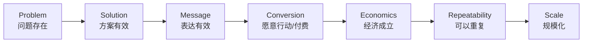

<div align="center">

# 📈 Acquisition Growth Radar（获客增长雷达）

### 从“没人知道”到“有人购买”，再到“可以重复增长”

**不是渠道清单，也不是“多发内容、多投广告”的营销建议。它是一套用证据逐层验证获客、成交与增长的方法。**

[简体中文](./README.md) · [English](./README_EN.md) · [完整 Skill 规则](./SKILL.md)


</div>

---

## 它解决什么问题？

很多项目并不是没有“营销动作”，而是不知道这些动作到底证明了什么：

- 有播放量，是不是说明有人会买？
- 有人点赞，是不是说明产品有需求？
- 有人询价但没成交，问题出在哪？
- 到底应该先做内容、SEO、Creator，还是直接投广告？
- 一条素材爆了，值得马上加预算吗？
- 拿到第一单之后，什么时候才算真正跑通？
- CAC、利润、复购、退款应该怎么一起看？

**Acquisition Growth Radar** 的核心不是回答“哪个渠道最好”，而是回答：

> **现在到底缺哪一层证据？下一步最便宜、最有信息价值的验证是什么？**

---

## 一句话记住整个模型



> **每进入一个更昂贵的阶段之前，先用更便宜的证据证明上一层成立。**

---

## 最重要的证据阶梯

| 层级 | 典型信号 | 能证明什么 | 不能证明什么 |
|---|---|---|---|
| **Problem** | 搜索、抱怨、访谈、评论 | 问题真实存在 | 会买你的方案 |
| **Attention** | 展示、播放、停留 | 表达能抓住注意 | 商业需求 |
| **Interest** | 点击、回复、收藏、询问 | 愿意继续了解 | 愿意付费 |
| **Intent** | 注册、预约、加购、报价申请 | 有行动意图 | 最终成交 |
| **Transaction** | 真实付款、签约、付费试点 | 至少有人愿意交换价值 | 可以重复 |
| **Repeatability** | 多个独立成交仍成立 | 不是偶然 | 大规模仍成立 |
| **Economics** | CAC、贡献利润、退款/流失可控 | 模型有机会赚钱 | 扩量后仍稳定 |
| **Scale** | 加大投入后边际结果仍可接受 | 可以扩大 | 永久有效 |

所以：

> **播放量不是需求，点赞不是购买意愿，一单不是 PMF，营收也不等于利润。**

---

## Skill 会怎么推进一个项目？

当你说：

```text
我有一个新产品，帮我制定获客方案。
```

它不会直接回答“做 TikTok + SEO + Meta”。

它会先判断项目在哪一层：

```text
项目背景
↓
Problem Evidence
↓
Solution Proof
↓
Message / Creative
↓
Offer / Conversion
↓
Commercial Evidence
↓
Unit Economics
↓
Repeatability
↓
Scale
```

然后只解决**当前最大的未知项**。

---

## 四种决策

每一轮实验最终只允许四种结果：

### KILL
证据已经足够说明方向不值得继续。

### ITERATE
问题存在，但产品、表达、Offer、转化路径或渠道需要改。

### KEEP
出现正向信号，继续积累证据，但还没有资格放大。

### SCALE
效果、转化、经济性和重复性都出现足够证据，可以扩大投入。

---

## 它不负责什么？

这个 Skill **不接管产品战略或选品决策**。

上游负责：

> **你究竟提供什么价值、做什么产品/服务。**

Acquisition Growth Radar 负责：

> **这个价值如何被证明、表达、转化、获客，以及是否值得放大。**

如果获客证据反过来说明产品本身有问题，它会明确把结论反馈给上游，而不是悄悄把自己变成产品经理。

---

## 最快调用方式

### 从零制定获客系统

```text
按 Acquisition Growth Radar 帮我分析这个项目。
不要先给渠道清单，先判断我当前缺哪一层证据。
告诉我当前阶段、已有证据、最大未知项、最小验证实验、成功/失败条件，以及下一步。
```

### 判断一个项目为什么不转化

```text
按 Acquisition Growth Radar 复盘这个项目。
区分 Problem、Solution、Message、Conversion、Economics 和 Repeatability，
不要把流量好看误判成商业成立。
```

### 继续上一轮

```text
继续按 Acquisition Growth Radar 推进。
已经 PASS 的阶段不要重复研究，除非出现了会推翻原结论的新证据。
```

### 判断是否值得投广告

```text
按 Acquisition Growth Radar 判断现在是否已经具备 Paid Scale 条件。
列出缺失 Gate，不满足就不要直接建议加预算。
```

---

## 推荐输出格式

每次推进都尽量回答：

```text
最终目标：
当前阶段：
已有证据：
仍未证明：
当前最大瓶颈：
本轮实验：
成功条件：
Kill 条件：
本轮完成：
下一步：
是否需要用户介入：
```

这样即使项目推进很多轮，也不会失去大方向。

---

## 适用范围

这套方法不依赖某一种业务：

- 实物商品
- SaaS
- App / 插件
- AI 工具
- 咨询 / 服务
- 课程 / 内容产品
- 社群
- B2B
- 线下业务
- Marketplace / 平台型项目

转化路径可以是商品页，也可以是私信、预约、销售电话、试用、Demo、门店或合同。

---

## 目录

```text
acquisition-growth-radar/
├── README.md
├── README_EN.md
├── SKILL.md
├── references/
│   ├── 01-evidence-ladder.md
│   ├── 02-proof-and-claim.md
│   ├── 03-message-offer-channel.md
│   ├── 04-experiments-and-economics.md
│   └── 05-operating-loop.md
├── examples/
│   └── README.md
└── templates/
    ├── evidence-log.csv
    ├── claim-registry.csv
    ├── experiment-cells.csv
    ├── channel-scorecard.csv
    ├── unit-economics.csv
    └── weekly-growth-review.md
```

---

## 核心哲学

> **真正的增长，不是同时做更多事情。**
>
> **而是不断找到当前最关键的不确定性，用最低成本获得足够证据，然后只放大已经被证明的东西。**

<div align="center">

### Evidence before scale.

**先证明，再放大。**

</div>
