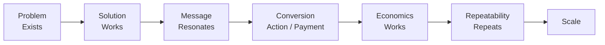

<div align="center">

# 📈 Acquisition Growth Radar

### From “nobody knows” to “someone buys” to repeatable growth

**Not a channel checklist and not a generic “post more, run more ads” playbook. It is an evidence-driven system for validating acquisition, conversion, economics, and scale.**

[简体中文](./README.md) · [English](./README_EN.md) · [Full Skill Rules](./SKILL.md)


</div>

---

## What problem does it solve?

Many projects are already doing “marketing,” but still cannot tell what their activity actually proves:

- Does high reach mean real demand?
- Do likes mean people will buy?
- If people ask questions but do not convert, what is broken?
- Should we start with content, SEO, creators, community, or paid media?
- If one creative performs well, should we scale immediately?
- Does the first sale mean the model works?
- How should CAC, contribution margin, churn, refunds, and repeatability be evaluated together?

**Acquisition Growth Radar** asks a different question:

> **Which layer of evidence is missing right now, and what is the cheapest experiment that can change the decision?**

---

## The whole model in one line



> **Before entering a more expensive stage, use cheaper evidence to validate the previous one.**

---

## The evidence ladder

| Level | Typical signals | What it proves |
|---|---|---|
| **Problem** | complaints, search, interviews, reviews | the problem exists |
| **Attention** | impressions, views, watch time | the message can capture attention |
| **Interest** | clicks, replies, saves, inquiries | people want to learn more |
| **Intent** | sign-up, booking, add-to-cart, quote request | meaningful action intent |
| **Transaction** | real payment, contract, paid pilot | at least one value exchange happened |
| **Repeatability** | multiple independent conversions | it was not a one-off |
| **Economics** | CAC, contribution, churn/refund under control | the model may be economically viable |
| **Scale** | marginal performance remains acceptable as spend grows | expansion is currently justified |

So:

> **Views are not demand. Likes are not purchase intent. One sale is not PMF. Revenue is not profit.**

---

## How the Skill works

When you say:

```text
I have a new product. Help me build an acquisition plan.
```

it should not jump straight to “TikTok + SEO + Meta.”

It first identifies the current state:

```text
Context
↓
Problem Evidence
↓
Solution Proof
↓
Message / Creative
↓
Offer / Conversion
↓
Commercial Evidence
↓
Unit Economics
↓
Repeatability
↓
Scale
```

Then it works on the **largest unresolved uncertainty**.

---

## Four decisions only

### KILL
Evidence says the direction is not worth continuing.

### ITERATE
The problem is real, but the solution, message, offer, conversion path, or channel needs revision.

### KEEP
There is a positive signal, but not enough evidence to scale.

### SCALE
Performance, conversion, economics, and repeatability have enough evidence to justify more investment.

---

## What it does not own

This Skill does **not** replace product strategy, product selection, R&D, supply chain, delivery design, legal review, or accounting.

Upstream owns:

> **What value you provide.**

Acquisition Growth Radar owns:

> **How that value is proven, communicated, converted, acquired, and evaluated for scale.**

If acquisition evidence suggests the product itself should change, the Skill surfaces that evidence back to the upstream product decision instead of silently taking over product strategy.

---

## Quick invocation

```text
Use Acquisition Growth Radar to analyze this project.
Do not start with a channel checklist.
First identify the current evidence stage, what is already proven, the biggest unknown, the minimum useful experiment, success/failure conditions, and the next step.
```

To continue:

```text
Continue using Acquisition Growth Radar.
Do not repeat stages that already passed unless new evidence invalidates them.
```

To evaluate paid scaling:

```text
Use Acquisition Growth Radar to decide whether we are ready for paid scale.
List the missing gates. If the gates are not met, do not recommend increasing budget.
```

---

## Recommended status output

```text
Final goal:
Current stage:
Overall progress:
Evidence already present:
Still unproven:
Biggest bottleneck:
This round:
Success condition:
Kill condition:
Next step:
User intervention required:
```

---

## Core philosophy

> **Growth is not doing more things at once.**
>
> **It is finding the most important uncertainty, obtaining enough evidence at the lowest reasonable cost, and scaling only what has already been proven.**

<div align="center">

### Evidence before scale.

</div>
