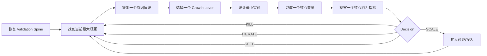

# Operating Loop｜持续运行循环 v0.2

## 核心执行引擎

默认不是“继续补更多营销动作”，而是：



一句话：

> **Evidence → Bottleneck → Lever → Experiment → Decision**

---

## 每轮先问

1. 最终目标是什么？
2. Validation Spine 里哪些已经证明？
3. 最大行为断点/商业断点是什么？
4. 用户是不想要，还是不相信，还是没有体验到价值？
5. 哪个 Growth Lever 最可能导致当前断点？
6. 最低成本、最能改变决策的实验是什么？
7. 这轮只看哪个核心指标？
8. 什么结果会触发 KEEP / ITERATE / KILL / SCALE？

---

## Lite Loop｜默认模式

绝大多数日常实验先使用：

```text
当前瓶颈：
我的假设：
本轮只改：
核心指标：
成功标准：
Kill 条件：
结果：
Learning：
Decision：KEEP / ITERATE / KILL / SCALE
```

核心压缩为：

> **瓶颈 → 假设 → 一改 → 一指标 → 决策**

见 `../templates/lite-growth-loop.md`。

---

## Full Acquisition Cell｜重要实验

只有在以下情况默认升级：

- 预算或资源投入较大
- 关键价格测试
- 多渠道/多素材严格比较
- 高风险 Claim
- 结果会触发重大产品或资源决策
- 需要严格归因和审计

使用 `../templates/experiment-cells.csv`。

原则：

> **Lite 用来快速学习；Full 用来严格归因。**

---

## Activation 检查

每个业务都应明确自己的 Aha：

> **用户第一次亲自体验核心价值的事件是什么？**

记录：

- PRE_TRANSACTION
- POST_TRANSACTION
- BOTH

不要因为注册、打开、提交表单等代理指标好看，就假设用户已经体验到价值。

---

## Trust 检查

当用户在某一步停止时，至少考虑两个解释：

```text
不想要
vs
不相信
```

如果需求/兴趣存在但交易弱，优先检查 Proof、Trust、风险、Offer、Price 与 Conversion Friction，而不是机械增加流量。

---

## 连续推进

用户说“继续”时：

- 不重做已经 PASS 的事实
- 恢复当前 Validation Spine
- 从当前最大 Bottleneck 开始
- 能自己完成的研究和分析直接完成
- 默认跑 Lite Loop
- 高成本/重要实验再用 Full Cell
- 遇到真实世界不可替代输入再请求介入
- 每轮写清楚 Learning 与 Decision

---

## BLOCKED_BY_REAL_INPUT

典型包括：

- 物理样品 / 实物测试
- 真实付款
- 用户访谈
- 销售电话
- 账户权限
- 不可逆操作
- 内部成本 / 经营数据
- 重大品牌或法律选择

遇到这些情况应暂停对应分支，而不是编造数据继续。

---

## 每周复盘

1. 本周新增了什么事实？
2. 哪个假设被证伪？
3. 哪个瓶颈已经被解除？
4. 哪个新瓶颈现在最重要？
5. 哪个 Lever 对行为变化贡献最大？
6. Repeatability 与 Economics 各推进到了哪里？
7. 下周最多做哪 1–3 个最有信息价值的实验？

---

## 每轮状态输出

推荐：

```text
最终目标：
Validation Spine：
整体进展：
已证明：
仍未证明：
当前最大瓶颈：
最可能 Growth Lever：
本轮实验：Lite / Full
核心指标：
成功 / Kill 条件：
本轮完成：
Decision：
下一步：
是否需要用户介入：
```

---

## 回退规则

已验证事实只有在以下情况回退：

- 上游产品/服务发生重大变化
- 新证据直接推翻原结论
- 原证据口径错误或不可复现
- 目标用户/市场/渠道发生重大变化

不要因为“想再研究得更完整”而无止境回退。
