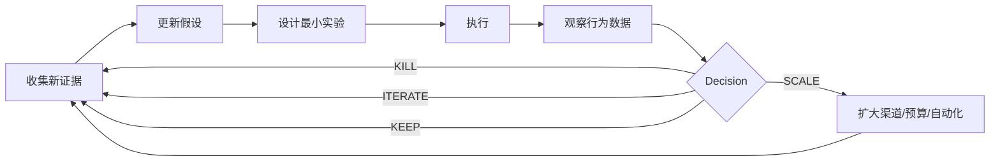

# Operating Loop｜持续运行循环

## 基本循环



## 每轮先问

1. 当前最终目标是什么？
2. 现在在哪一层证据？
3. 哪些已经 PASS？
4. 最大未知项是什么？
5. 什么实验最便宜但最能改变决策？
6. 这轮结束后会做什么决定？

## 连续推进

用户说“继续”时：

- 不重做已经 PASS 的研究
- 从当前最大的 UNKNOWN 开始
- 能自己完成的研究和分析直接完成
- 遇到真实世界不可替代输入再请求介入
- 每轮结束更新状态

## BLOCKED_BY_REAL_INPUT

典型包括：

- 物理样品/实物测试
- 真实付款
- 用户访谈
- 销售电话
- 账户权限
- 不可逆操作
- 内部成本/经营数据
- 重大品牌或法律选择

遇到这些情况应暂停对应分支，而不是编造数据继续。

## 每周复盘五问

1. 本周新增了什么事实？
2. 哪个假设被证伪？
3. 哪个 Acquisition Cell 表现最好，为什么？
4. 当前最大的瓶颈是什么？
5. 下周最多做哪 1–3 个最有信息价值的实验？

## 每轮状态输出

推荐保持：

```text
最终目标：
当前阶段：
整体进展：
已有证据：
仍未证明：
当前最大瓶颈：
本轮完成：
下一步：
是否需要用户介入：
```

## 回退规则

已 PASS 的阶段只有在以下情况回退：

- 上游产品/服务发生重大变化
- 新证据直接推翻原结论
- 原证据发现口径错误或不可复现
- 目标用户/市场/渠道发生重大变化

不要因为“想再研究得更完整”就无止境回退。
