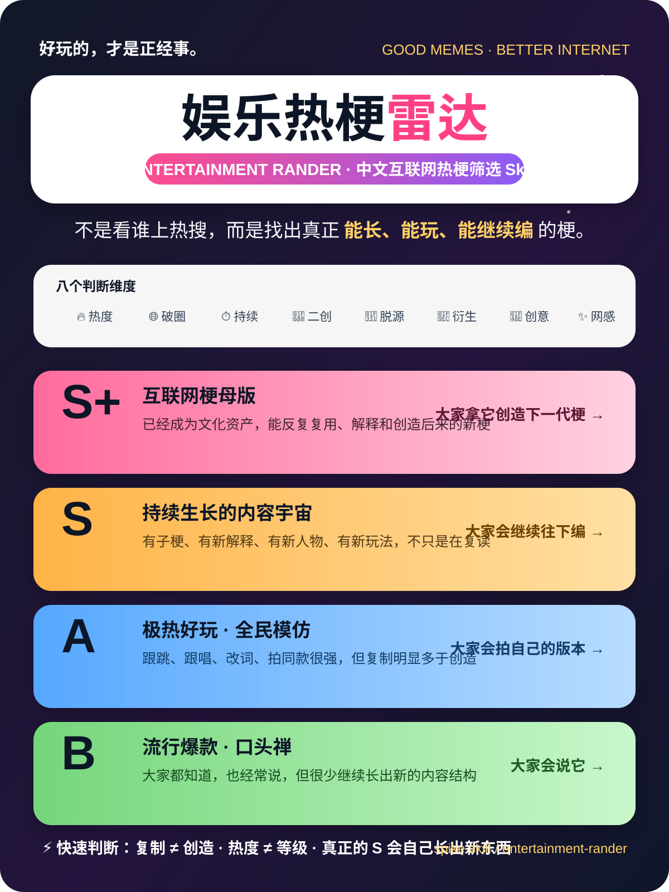

<div align="center">

# 🎯 Entertainment Rander

### A radar and ranking skill for Chinese internet entertainment memes

**Not a trending-news tracker. It finds memes people actually keep remixing, quoting, excavating, and building on.**

[简体中文](./README.md) · [English](./README_EN.md) · [Skill Rules](./SKILL.md)


</div>

---



## ✨ What does it solve?

A normal trending list tells you **what made the news today**.

Entertainment Rander asks a different question:

> **What is the Chinese internet actually playing with right now—and which memes are growing into reusable meme universes instead of dying after one trend cycle?**

It deliberately filters out celebrity news, one-day hot searches, overly serious cultural events, and viral content with huge views but little creative remixing.

---

## 🏆 Four tiers at a glance

| Tier | Core idea | What people do |
|---|---|---|
| **S+** | A reusable internet meme template | **People use it to explain and create future memes** |
| **S** | A meme keeps generating new content | **People keep building on it** |
| **A** | Mass participation, mostly template replication | **People make their own version** |
| **B** | High recognition, high repetition, low expansion | **People say it** |

### Calibration examples

- **S+**: Zhenxue (甄学), Mingxue (明学)
- **S**: *Divas Hit the Road 2* archaeology, *The First Half of My Life* archaeology, Mailin meme universe, Skill Gomoku, “Huai Min was still awake”
- **A**: Subject Three dance, Good Night Miss, Dig Dig Dig, Dinosaur Kanglang
- **B**: “You must be starving”, Shuan Q, Tai Ku La, Zun Du Jia Du

---

## 🧠 Evaluation dimensions

The skill considers:

`Entertainment value` · `Cross-circle reach` · `Longevity` · `Remixability` · `Source independence` · `Derivative potential` · `Creative density` · `Internet-native feel`

The key question is not:

> “How many people watched it?”

It is:

> **“Are people just watching and repeating—or are they imitating, remixing, and creating new layers?”**

---

## 🚀 Quick start

Ask an AI:

```text
Use the Entertainment Rander standard to identify the Chinese internet entertainment memes that actually matter right now.
Do not treat celebrity news or raw trending volume as a meme signal. Avoid overly serious topics.
Rank candidates as S+ / S / A / B and explain whether people merely say it, imitate it, build on it, or use it as a reusable meme template.
```

Or simply ask:

```text
Does “XXX” qualify as an S-tier meme? Evaluate it using Entertainment Rander.
```

---

## 🔍 What it is especially good at finding

- 📼 **Content archaeology** — old shows or dramas suddenly becoming shared remix libraries
- 🧪 **Character “schools”** — one personality spawning a vocabulary, theory system, or meme discipline
- 🌀 **Absurd meme systems** — content with its own logic, language, characters, and worldbuilding
- 🎵 **Sticky audio memes** — not just sing-alongs, but sounds that keep producing new formats
- 🧬 **Meme parents** — formats that continuously generate child memes and revive in new contexts

---

## ⚠️ One rule matters most

**Virality is not the same as tier.**

A dance with billions of views can still be A-tier if everyone is simply copying the same template. A smaller phenomenon can be S-tier when it keeps generating characters, stories, reinterpretations, archaeology, and new rules.

> **B: People say it.**  
> **A: People imitate it.**  
> **S: People keep building on it.**  
> **S+: People use it to create the next meme.**

---

<div align="center">

### Great memes make ordinary days more fun.

**Good memes. Better internet.**

</div>
