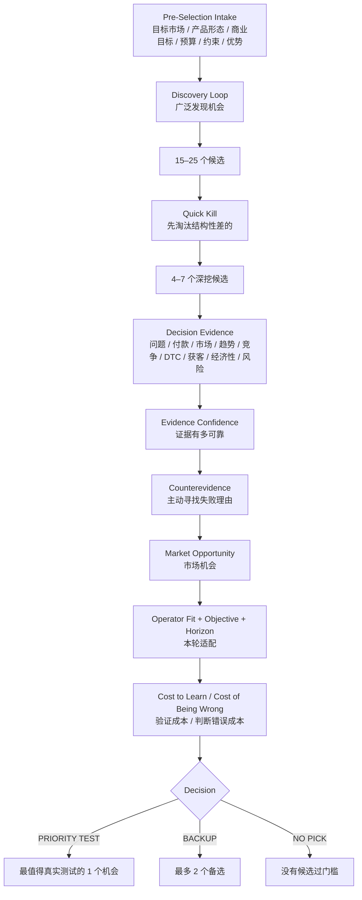

<div align="center">

# 🧭 Independent Store Product Opportunity（独立站选品决策系统）

### 面向 DTC / 独立站的产品机会发现与筛选 Skill

**不是“爆款榜”或“最近什么火”的推荐器，而是把趋势、需求、真钱、竞争、获客与经济性组合起来，筛出最值得用真实市场继续验证的产品机会。**

[简体中文](./README.md) · [English](./README_EN.md) · [完整 Skill 规则](./SKILL.md)


</div>

---

## 它解决什么问题？

很多独立站选品的问题，不是“找不到产品”，而是**不知道哪些信号真的能证明这是一个值得进入的生意**：

- Google Trends 上涨，是趋势还是短期噪声？
- TikTok / YouTube 高频出镜，是自然需求还是集中投放？
- Amazon 卖得很多，为什么消费者还要来独立站买？
- 某个虚拟产品有人讨论，但真的有人付钱吗？
- 一个品类市场很大，是否已经高度商品化？
- 毛利看起来很高，扣掉 CAC、退款和履约以后还能赚钱吗？
- 同一个机会，对不同操盘者为什么优先级不同？

**Independent Store Product Opportunity** 不先宣布“赢家”，而是先区分：

> **什么只是发现信号？什么才是决策证据？哪个机会最值得先拿真实用户、真实流量和真实付款验证？**

---

## 它是不是专门服务独立站？

是。

它专门服务于 **DTC / Independent Store（独立站直接面向消费者）** 的产品机会判断，因此会特别检查：

- 为什么消费者要从独立站买，而不是 Amazon / Temu / Etsy / 平台最低价；
- 是否有持续的内容、搜索、Creator 或社区获客空间；
- 是否能承受独立站真实 CAC、支付、退款、物流与售后；
- 是否能形成品牌、Bundle、Personalization、Identity、Trust 或其他 DTC Wedge。

它不是 Amazon 站内选品器、TikTok Shop 爆品榜，也不是供应商搜索工具。

---

## 适用于哪个地区？

**不绑定任何固定地区。**

美国、中国、日本、欧洲、东南亚等都可以使用，但不同地区的：

- 用户问题；
- 搜索和社交趋势；
- 价格带；
- 平台替代方案；
- 支付意愿；
- CAC；
- 物流 / 税务 / 合规；

可能完全不同。

因此 v2.1 把 **目标市场 / 语言** 放在正式筛选前的 Intake Gate。没有指定地区时，Skill 应先询问，而不是偷偷套用美国市场或历史用户画像。

> **中国证据不能直接证明美国付款，Amazon 成交也不能直接证明独立站成立。**

---

## v2.1 的核心流程



一句话：

> **先找得广，再判得准；先证明商业结构，再决定当前最值得测试什么。**

---

## 正式筛选前会先问什么？

Skill 本体**不保存任何人的个人画像或历史项目偏好**。

开始前只补问当前对话里未知、且会显著改变结果的信息，默认最多 6 个问题：

1. 目标市场 / 语言；
2. 允许的产品形态：实物 / 数字 / SaaS / OPEN；
3. 商业目标：现金流、单人业务、长期品牌、可扩展软件或学习验证；
4. 首轮测试预算、最大可接受损失、希望多久拿到第一轮证据；
5. 库存、物流、售后、退款、监管等硬约束；
6. 本轮可利用的受众、内容、技术、供应链、专业知识或获客优势。

用户输入只属于**本次 Run**，不会写回通用 Skill。

---

## 它怎么发现候选？

不是只有“看趋势”一种方法。

| Discovery Engine | 典型思路 |
|---|---|
| **Behavior / Trend-first** | 新行为或生活方式上涨 → 场景 → 高频产品 → 痛点 → 二次验证 |
| **Problem / Workaround-first** | 重复痛点 → 当前凑合方案 → 为什么不好用 → 新机制 |
| **Review-gap-first** | 已有大量交易 → 1–3 星差评 → Must Keep / Must Fix |
| **Transaction-structure-first** | 从真实交易市场看价格带、头部集中、新品渗透和结构缺口 |
| **Service-to-Productization** | 已成熟人工服务 → 重复交付 → 自动化成数字产品 / AI Workflow |
| **Capability / Adjacency-first** | 从当前可利用能力出发寻找相邻机会，但能力不能代替市场证据 |

趋势、社媒出镜、榜单都可以帮忙发现机会，**但不能单独决定产品。**

---

## 真正决定 Top 的九层证据

| 维度 | 最核心的问题 |
|---|---|
| **Job / Problem Reality** | 用户真的有这个问题吗？严重、频繁吗？ |
| **Payment Reality** | 用户是否已经用真钱解决？ |
| **Reachable Market Depth** | 不是 TAM，而是我们实际够得着多少人？ |
| **Timing / Persistence** | 是长期增长、稳定需求还是短期热点？ |
| **Competition Structure** | 还有结构性缺口，还是已经完全商品化？ |
| **DTC Wedge** | 为什么一定要从我们的独立站买？ |
| **Acquisition Fit** | 能不能持续、经济地获得目标用户？ |
| **Economics** | 扣掉 CAC、退款、履约以后还赚钱吗？ |
| **Delivery / Risk** | 能不能稳定兑现，失败模式是什么？ |

评分之后还要单独看 **Evidence Confidence、Operator Fit、商业目标、时间周期、Cost-to-Learn 和 Cost-of-Being-Wrong**。

---

## 最终不会只给一个“82 分”

一个候选可能出现：

```text
Market Opportunity: 89 / 100
Evidence Confidence: B
Operator Fit: 18 / 25
Time Horizon: 6–24 months
Cost to Learn: Low
Cost of Being Wrong: Low
Decision: PRIORITY TEST
```

另一个候选即使市场更大，也可能因为库存、CAC、竞争或失败成本过高而降级为 `HOLD`。

**市场好 ≠ 现在最应该做。**

---

## 最快调用方式

### 从零选独立站产品

```text
按 Independent Store Product Opportunity v2.1 帮我从零选品。
先问我真正会影响结果的关键信息，再开始筛选。
不要因为趋势上涨或销量高就直接推荐。
```

### 实物和虚拟产品一起选

```text
我想做独立站，实物、虚拟产品和微型 SaaS 都可以。
请从零生成候选，最后只给 1 个 Priority Test 和最多 2 个备选。
```

### 验证别人推荐的“爆品”

```text
有人说这个产品最近很火。
按这个 Skill 判断它究竟只是趋势信号，还是一个真正值得进入的 DTC 机会。
```

### 比较已有候选

```text
比较这几个产品。
分别检查真实付费、竞争、DTC 优势、获客、经济性和失败成本，
告诉我哪个最值得先做真实测试。
```

---

## 它不负责什么？

选品完成后，它不会继续接管：

- 最终供应商谈判与采购；
- 建站与页面实现；
- 广告投放执行；
- 完整法律 / 税务 / 合规审查；
- 用桌面研究替代真实 PMF。

后续推荐衔接：

```text
实物机会 → Sourcing / Supplier Validation
虚拟机会 → Delivery / Trust / Privacy Validation
全部机会 → Acquisition Growth Radar
              ↓
       真实 Attention → Activation → Intent → Transaction
```

---

## 目录

```text
independent-store-product-opportunity/
├── README.md
├── README_EN.md
├── SKILL.md
├── metadata.yml
├── references/        # 证据、评分、趋势、数字/实物产品等深入规则
├── templates/         # Intake、Evidence、Scoring、Validation 等模板
└── examples/          # 方法示例，不保存任何特定用户画像
```

---

## 核心哲学

> **最火的产品，不一定是最好的独立站机会。**
>
> **真正值得测试的，是用户问题、真实付款、市场结构、获客和经济性能够同时成立，并且当前验证成本合理的商业假设。**

<div align="center">

### Discover broadly. Decide with evidence. Validate with reality.

**广泛发现，证据决策，真实验证。**

</div>
