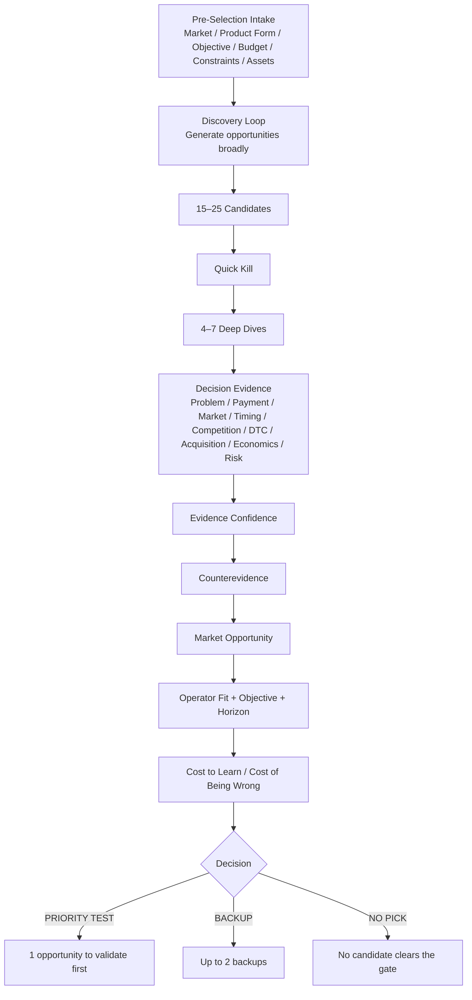

<div align="center">

# 🧭 Independent Store Product Opportunity

### Product opportunity discovery and selection for DTC / independent stores

**Not a “winning product” list. This skill combines demand, real payment, timing, competition, acquisition, DTC advantage, and economics to identify which product opportunity is most worth validating in the real market.**

[简体中文](./README.md) · [English](./README_EN.md) · [Full Skill Rules](./SKILL.md)


</div>

---

## What problem does it solve?

Independent-store product research often fails because people confuse **interesting signals** with **evidence that a business is worth entering**.

Typical questions include:

- Is a rising Google Trends curve a durable opportunity or short-term noise?
- Does frequent TikTok / YouTube appearance reflect organic demand or concentrated promotion?
- If a product sells well on Amazon, why should anyone buy it from an independent store?
- Are people only discussing a digital product, or are they actually paying?
- Is a large market already completely commoditized?
- Does the margin still work after CAC, refunds, fulfillment, and support?
- Why can the same market opportunity deserve different priorities for different operators?

The skill therefore asks:

> **What is merely a discovery signal, what is decision-grade evidence, and which opportunity is most worth testing with real users, real traffic, and real payment?**

---

## Is it specifically for independent stores?

Yes.

It is designed for **DTC / independent-store** opportunity selection, so it explicitly asks:

- Why would a customer buy from this store instead of Amazon, Temu, Etsy, or a marketplace alternative?
- Is there a sustainable search, content, creator, or community acquisition path?
- Can the product survive real DTC CAC, payment fees, refunds, shipping, and support?
- Can the offer create a meaningful DTC wedge through brand, bundles, personalization, identity, trust, or exclusive design?

It is not an Amazon keyword-ranking tool, a TikTok Shop “hot product” list, or a supplier-search skill.

---

## Which region is it for?

**It is region-agnostic.**

It can be used for the United States, China, Japan, Europe, Southeast Asia, or other target markets. But demand, willingness to pay, alternatives, CAC, logistics, regulation, and price bands may differ dramatically by market.

That is why v2.1 makes **target market / language** part of the mandatory pre-selection intake. If the region is not already known, the skill asks first instead of silently assuming the United States or reusing a historical user profile.

> **Evidence from China does not directly prove U.S. payment behavior, and marketplace sales do not directly prove DTC viability.**

---

## v2.1 workflow



In one sentence:

> **Discover broadly, decide carefully, then validate with reality.**

---

## What does it ask before formal selection?

The reusable skill contains **no built-in personal profile or historical user preference**.

Before screening, it only asks for missing inputs that materially change the result, normally no more than six:

1. target market / language;
2. allowed product forms: physical / digital / SaaS / OPEN;
3. business objective: cash flow, lifestyle business, brand asset, scalable software, or learning test;
4. test budget, maximum acceptable loss, and desired validation speed;
5. hard constraints around inventory, logistics, support, refunds, and regulation;
6. usable audience, content, technical, supply-chain, domain, or acquisition advantages.

These inputs belong only to the current run and are never written back into the reusable skill.

---

## Six discovery engines

| Discovery Engine | Typical logic |
|---|---|
| **Behavior / Trend-first** | New behavior or lifestyle growth → real usage scene → recurring product → pain point → revalidation |
| **Problem / Workaround-first** | Repeated pain → current workaround → failure or cost → new mechanism |
| **Review-gap-first** | Existing transaction volume → 1–3 star reviews → Must Keep / Must Fix |
| **Transaction-structure-first** | Real marketplaces → price bands, concentration, new-product penetration, structural gaps |
| **Service-to-Productization** | Mature paid service → repeated delivery → automate into digital product / AI workflow |
| **Capability / Adjacency-first** | Use current assets to discover adjacent opportunities, without treating capability as market proof |

Trend signals, social appearance, and bestseller lists can generate candidates, but **they cannot decide the winner by themselves**.

---

## Nine layers of decision evidence

| Dimension | Core question |
|---|---|
| **Job / Problem Reality** | Is the problem real, frequent, and meaningful? |
| **Payment Reality** | Are people already spending money to solve it? |
| **Reachable Market Depth** | How much of the market can actually be reached? |
| **Timing / Persistence** | Durable growth, stable demand, or short-lived fad? |
| **Competition Structure** | Is there still a structural gap, or is it fully commoditized? |
| **DTC Wedge** | Why buy from this independent store? |
| **Acquisition Fit** | Can qualified customers be acquired repeatedly and economically? |
| **Economics** | Does it still make money after CAC, refunds, and delivery? |
| **Delivery / Risk** | Can the promise be fulfilled consistently and safely? |

The final decision also keeps **Evidence Confidence, Operator Fit, Business Objective, Time Horizon, Cost-to-Learn, and Cost-of-Being-Wrong** separate from the market score.

---

## It does not reduce everything to one score

A candidate may look like:

```text
Market Opportunity: 89 / 100
Evidence Confidence: B
Operator Fit: 18 / 25
Time Horizon: 6–24 months
Cost to Learn: Low
Cost of Being Wrong: Low
Decision: PRIORITY TEST
```

Another candidate may have a larger total market yet be downgraded because of inventory exposure, CAC, competition, or failure cost.

**A good market is not automatically the best thing to do next.**

---

## Fastest ways to use it

### Select a product from scratch

```text
Use Independent Store Product Opportunity v2.1 to select a DTC product from scratch.
Ask only the missing high-impact questions first.
Do not recommend something merely because its trend or sales are high.
```

### Compare physical, digital, and SaaS opportunities

```text
I am open to physical products, digital products, and micro-SaaS.
Generate candidates from scratch and end with only 1 Priority Test and up to 2 backups.
```

### Validate a claimed “winning product”

```text
Someone says this product is hot right now.
Use the skill to determine whether it is merely a trend signal or a real DTC opportunity.
```

---

## What does it not do?

After product selection, it does not take over:

- final sourcing and supplier negotiation;
- website implementation;
- paid-media execution;
- full legal / tax / regulatory review;
- real PMF validation.

Recommended handoff:

```text
Physical opportunity → Sourcing / Supplier Validation
Digital opportunity → Delivery / Trust / Privacy Validation
All opportunities → Acquisition Growth Radar
                    ↓
          Attention → Activation → Intent → Transaction
```

---

## Directory

```text
independent-store-product-opportunity/
├── README.md
├── README_EN.md
├── SKILL.md
├── metadata.yml
├── references/
├── templates/
└── examples/
```

---

## Core philosophy

> **The hottest product is not necessarily the best independent-store opportunity.**
>
> **The opportunity worth testing is the one where real customer problems, real payment, market structure, acquisition, and economics can work together — at a reasonable cost of learning.**

<div align="center">

### Discover broadly. Decide with evidence. Validate with reality.

**Find signals broadly. Commit only when the evidence earns it.**

</div>
