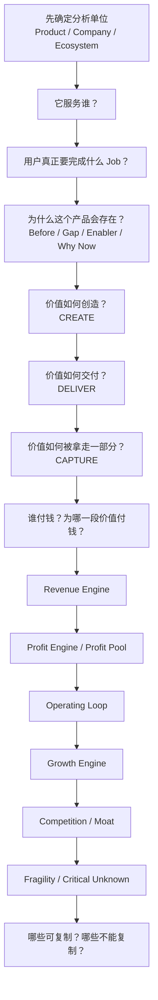

<div align="center">

# 🔬 Product Business Teardown（产品商业拆解）

### 把一个产品从“它有什么功能”拆到“这门生意为什么能转起来”

**服务谁？为什么存在？谁付钱？付的是哪一段价值？真正利润可能在哪里？整套产品与商业系统如何循环？**

[简体中文](./README.md) · [English](./README_EN.md) · [完整 Skill](./SKILL.md)


</div>

---

## 它解决什么问题？

看到一个产品时，最容易停留在表面：

> “它是一个 AI 工具。”  
> “它靠订阅赚钱。”  
> “它服务年轻人。”

但真正值得理解的是：用户为什么会“雇佣”这个产品；产品出现前怎么解决；为什么现在成立；使用者、付款者和受益者是否相同；用户到底在为软件、便利、时间、信任、风险承担、身份还是结果付钱；营收最大的部分是否也是利润最大的部分；免费产品为什么值得维护；整台商业机器怎样循环；哪些机制值得学、哪些依赖历史资产或规模。

**Product Business Teardown** 就是专门回答这些问题的。

---

## 不局限于独立站

它可以分析 SaaS / App、AI 产品 / API、实物消费品、数字商品、咨询 / 服务 / 教育、Marketplace / 平台、媒体 / 内容 / 社区、开源产品 / Developer Tool、多产品公司的单一产品线和混合商业模式。

---

## 核心逻辑



> **用户为什么需要 → 产品为什么存在 → 价值怎么产生 → 钱从哪来 → 利润可能在哪 → 机器怎么循环 → 为什么别人不能轻易拿走。**

---

## 最关键的区别：Revenue 不等于 Profit

Skill 会把三件事分开：

```text
Revenue Engine
收入从哪里进入

≠

Profit Engine
哪部分真正贡献更高经济利润

≠

Strategic Role
某产品即使不直接赚钱，为何仍值得存在
```

例如低毛利硬件可能靠耗材赚钱；免费产品可能向广告主收费；开源核心可能靠 Cloud / Enterprise / Support 变现；Marketplace 交易额很大但公司只拿 Take Rate；某产品自身不赚钱却承担获客或生态控制。

---

## 九层拆解

| 层 | 回答的问题 |
|---|---|
| Product Identity | 它到底是什么？分析边界是什么？ |
| Customer / JTBD | 服务谁？用户真正要完成什么？ |
| Why It Exists | 为什么会有这个产品？为什么现在成立？ |
| Value Architecture | 价值怎么创造、交付、捕获？ |
| Money & Profit Engine | 谁付钱？赚哪部分钱？利润可能在哪？ |
| Operating System | 整台机器具体怎么转？ |
| Growth Engine | 下一批用户怎么来？能否自增强？ |
| Competition / Moat | 真正替代是谁？什么最难复制？ |
| Fragility | 哪个假设一旦失效，整个模型会出问题？ |

---

## 证据纪律

真实产品默认需要公开研究，并区分 `FACT / INFERENCE / HYPOTHESIS / UNKNOWN / CONFLICT`。尤其禁止把“免费”直接解释成卖数据，把用户多直接解释成网络效应，把高营收直接解释成高利润，把融资多解释成商业模式已成立。

---

## 最快调用方式

```text
按 Product Business Teardown 帮我拆一下 Spotify。
重点告诉我：服务谁、为什么会有它、谁付钱、真正赚哪部分钱、整体运行逻辑。
```

```text
对这个产品做 Full Teardown。
不要只看官网功能，查公开资料并区分 FACT / INFERENCE / UNKNOWN。
把用户、付款者、价值流、钱流、利润引擎、运行闭环、增长和护城河全部拆出来。
```

---

## 与独立站选品 Skill 的关系

它不是选品器：先用 Product Business Teardown 把别人为什么成立拆懂；如果要判断这种机制能否变成自己的机会，再进入 Product Opportunity / 选品系统。

---

## 当前状态：v0.1.0 Calibrating

第一版先冻结通用商业解剖结构，下一步应拿订阅 SaaS、Marketplace、实体消费品、免费/广告产品、开源商业化产品分别校准。

---

<div align="center">

### Features tell you what a product does.
### Business anatomy tells you why it exists and where the money moves.

**不只看产品长什么样，而是打开后盖，看它为什么能转。**

</div>
