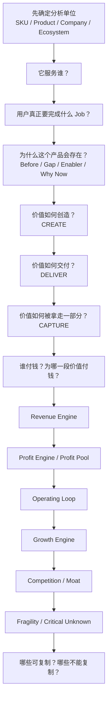

<div align="center">

# 🔬 Product Business Teardown（产品商业拆解）

### 把一个产品从“它有什么功能”拆到“这门生意为什么能转起来”

**服务谁？为什么存在？谁付钱？付的是哪一段价值？真正利润可能在哪里？整套产品与商业系统如何循环？**

[简体中文](./README.md) · [English](./README_EN.md) · [完整 Skill](./SKILL.md)


</div>

---

## 它解决什么问题？

看到一个产品时，最容易停留在表面：

> “它是一个 AI 工具。”
> “它靠订阅赚钱。”
> “它就是一双袜子。”

真正值得理解的是：

- 用户为什么会“雇佣”这个产品？
- 产品出现前，他们怎么解决？
- 为什么会出现这种产品形态？
- 使用者、付款者、真正受益者是不是同一个人？
- 用户到底在为产品本体、便利、时间、信任、风险承担、身份还是结果付钱？
- 收入最大的部分是不是利润最大的部分？
- 免费产品为什么值得公司维护？
- 平台为什么必须同时服务多边参与者？
- 整台商业机器怎么循环？
- 哪些机制值得学，哪些只是历史品牌、规模、牌照或网络效应？

**Product Business Teardown** 就是专门回答这些问题的。

---

## 产品不分大小

它既能分析 Spotify、Airbnb、GitLab，也能分析：

- 一双 Pilates 防滑袜；
- 一个宠物除毛刷；
- 一个 1688 / Amazon / Etsy 商品；
- 一个独立站 SKU；
- 一张你刚看到、不知道为什么有人买的商品图；
- 一个小型数字工具或单一付费功能。

支持 SaaS / App、AI/API、实物、小商品/单一 SKU、数字商品、咨询/服务/教育、Marketplace/平台、媒体/社区、开源产品和混合商业模式。

### 小商品模式

如果只有 Listing、SKU 或商品图，会切换到 **Small Product / Sparse Evidence Mode**：

```text
使用场景 / 购买触发
↓
谁用、谁买、谁影响购买
↓
以前用什么替代
↓
产品通过什么机制解决问题
↓
价格带 / 廉价替代
↓
商家在哪一段捕获价值
↓
材料 / 制造 / 包装 / 物流 / 平台 / 获客成本栈
↓
复购 / 损耗 / 耗材 / 替换 / 收藏 / 礼赠 / Bundle
↓
最容易复制与最难复制的部分
```

没有卖家财报也没关系。真实收入、毛利率、CAC 不知道就写 `UNKNOWN`，不会为了让报告看起来完整而编数字。

---

## 核心逻辑



一句话：

> **用户为什么需要 → 产品为什么存在 → 价值怎么产生 → 钱从哪来 → 利润可能在哪 → 机器怎么循环 → 为什么别人不能轻易拿走。**

---

## Revenue 不等于 Profit

Skill 会把三件事分开：

```text
Revenue Engine
收入从哪里进入

≠

Profit Engine
哪部分在具体利润层级贡献更强

≠

Strategic Role
某个产品即使不直接赚钱，为何仍值得存在
```

并进一步使用：

`Revenue → Gross Profit → Contribution Profit → Operating Profit → Net Income → Cash Flow / FCF`

所以不会把“高毛利”直接写成“很赚钱”，也不会把 Marketplace 的交易总额直接写成平台收入。

---

## 九层拆解

| 层 | 回答的问题 |
|---|---|
| Product Identity | 它到底是什么？分析边界是什么？ |
| Customer / JTBD | 服务谁？用户真正要完成什么？ |
| Why It Exists | 为什么会有这个产品？为什么现在成立？ |
| Value Architecture | 价值怎么创造、交付、捕获？ |
| Money & Profit Engine | 谁付钱？赚哪部分钱？利润在哪个层级？ |
| Operating System | 整台机器具体怎么转？ |
| Growth Engine | 下一批用户怎么来？能否自增强？ |
| Competition / Moat | 真正替代是谁？什么最难复制？ |
| Fragility | 哪个假设一旦失效，整个模型会出问题？ |

---

## 证据纪律

真实产品默认查公开资料，并区分：

- `FACT`：证据直接支持；
- `INFERENCE`：基于事实的合理推断；
- `HYPOTHESIS`：仍需验证；
- `UNKNOWN`：公开信息不足；
- `CONFLICT`：来源冲突。

尤其禁止：

> 免费产品 → “一定卖数据”
> 用户很多 → “一定有网络效应”
> 营收很多 → “利润一定很高”
> 一个 Listing 有销量 → “整个品类都赚钱”

---

## 最快调用方式

### 拆一个大产品

```text
按 Product Business Teardown 帮我拆一下 Spotify。
重点告诉我：服务谁、为什么会有它、谁付钱、真正赚哪部分钱、整体运行逻辑。
```

### 拆一个小商品

```text
按 Product Business Teardown 分析这个商品链接/图片。
别管背后公司大不大，告诉我谁会买、为什么需要、原来怎么解决、商家靠哪部分价值赚钱、成本大头、渠道、复购和最容易被替代的地方。
```

### 深度拆解

```text
对这个产品做 Full Teardown。
查公开资料并区分 FACT / INFERENCE / UNKNOWN。
把用户、付款者、价值流、钱流、利润层级、运行闭环、增长和护城河全部拆出来。
```

---

## 与独立站选品 Skill 的关系

它不是选品器。

```text
看到一个产品
↓
Product Business Teardown
先把它为什么成立拆懂
↓
发现可复制机制 / 不可复制优势
↓
如果要判断能不能变成自己的机会
↓
Independent Store Product Opportunity
```

因此它不要求产品来自独立站。

---

## 当前状态：v0.2.0 Calibrating

已用 Spotify、Airbnb、YETI、Duolingo、GitLab 五种不同商业机器，以及 **Pilates Grip Socks 这种单一小商品** 做首轮压力测试。

本轮新增：Financial Ladder、Marketplace 交易额→收入桥接、Channel Economics、Free/Packaging、关键依赖价值索取，以及 **Small Product / Sparse Evidence Mode**。

<div align="center">

### Features tell you what a product does.
### Business anatomy tells you why it exists and where the money moves.

**不只看产品长什么样，而是打开后盖，看它为什么能转。**

</div>
