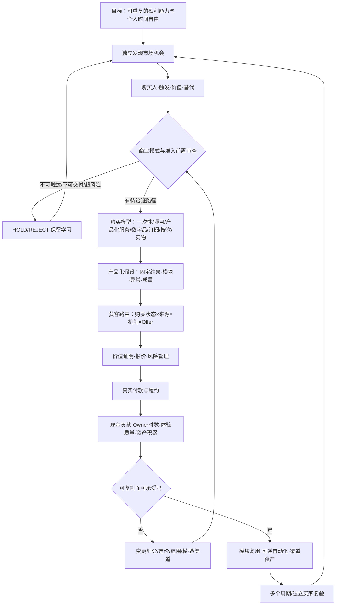

# 商业系统总图（文字可编辑源）

```mermaid
flowchart TD
 A[目标：可重复的盈利能力与个人时间自由] --> B[独立发现市场机会]
 B --> C[购买人·触发·价值·替代]
 C --> D{商业模式与准入前置审查}
 D -->|不可触达/不可交付/超风险| X[HOLD/REJECT 保留学习]
 D -->|有待验证路径| E[购买模型：一次性/项目/产品化服务/数字品/订阅/按次/实物]
 E --> F[产品化假设：固定结果·模块·异常·质量]
 F --> G[获客路由：购买状态×来源×机制×Offer]
 G --> H[价值证明·报价·风险管理]
 H --> I[真实付款与履约]
 I --> J[现金贡献·Owner时数·体验质量·资产积累]
 J --> K{可复制而可承受吗}
 K -->|否| L[变更细分/定价/范围/模型/渠道]
 L --> D
 K -->|是| M[模块复用·可逆自动化·渠道资产]
 M --> N[多个周期/独立买家复验]
 N --> B
 X --> B
```

**获客不是全部。** `买家来源`（搜索/平台/伙伴/名录/现有客户等）与 `触达机制`（主动/入站/撮合/引荐/广告）为不同轴；无“最佳平台”通用排序。参见 [获客路由](references/04a_acquisition_router.md)。
